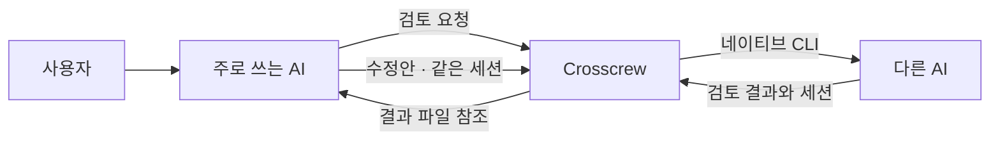

<div align="center">


**쓰던 AI에서 계속 일하세요. 중요한 순간에 다른 AI의 시야를 빌리세요.**

[](https://github.com/ktaey7/crosscrew/actions/workflows/tests.yml)
[](LICENSE)
[](https://github.com/ktaey7/crosscrew/releases)

[시작하기](#시작하기) · [실제로 해봤습니다](#실제로-해봤습니다) · [English](README.md)

</div>

## 혼자 보기엔 괜찮은 계획. 다른 AI는 어떻게 볼까요?

주로 쓰는 AI와 설계를 정리했습니다. 구현하기 전에 다른 모델에게 약점을
짚어보게 하고 싶습니다. 앱을 옮겨 다니거나, 대화 내용을 매번 복사하는 대신
이렇게 요청합니다.

> “Crosscrew로 Claude에게 이 계획의 약점을 검토시켜 줘.
> 우리가 고친 다음 같은 검토자에게 다시 확인받자.”

Crosscrew는 현재 AI 환경에서 다른 AI의 **네이티브 CLI**로 일을 전달합니다.
주 사용 AI가 결과를 판단하고 작업을 이어갑니다. 검토자의 세션을 유지해
수정안을 다시 보낼 수도 있습니다.

| 이런 순간에 | 이렇게 사용합니다 |
|---|---|
| 설계를 확정하기 전 | 다른 모델에게 숨은 가정과 실패 시나리오를 요청합니다. |
| 구현을 마친 뒤 | 코드와 검증 근거를 독립적으로 확인시킵니다. |
| 피드백을 반영한 뒤 | 같은 검토자에게 수정안을 보내 남은 문제를 확인합니다. |
| 구현을 맡길 때 | 허용한 범위의 작업을 전달하고 변경 내용과 테스트를 확인합니다. |

이미 설치하고 로그인해 둔 CLI를 사용합니다. 모든 모델을 구독할 필요도,
새 대시보드를 열 필요도 없습니다.

## 0.2.0 알파의 변경점

- **네 AI 호스트의 공통 호출 경로:** 서로 다른 provider로 향하는 12개 경로가 같은 broker를 사용합니다.
- **네 provider 모두 후속 요청:** `oneshot`, `fresh`, `resume`을 지원하고 Gemini의 실제 대화 ID를 처리합니다.
- **결과를 한 번에 회수:** `wait --summary`는 해시로 식별한 결과와 같은 바이트에서 답변·사용량을 반환합니다. `wait-many`는 최대 16개 작업을 함께 기다립니다.
- **명시적인 작업 권한:** Grok 실행 경로는 직접 선택하고, Gemini 명령 권한은 정확한 명령에 한해 임시로 부여합니다.
- **사용량의 한계를 표시:** provider별 수치를 분리하며, 모르는 사용량과 구독 한도 절감량을 만들어내지 않습니다.

[업데이트·사용법](docs/usage.md) · [작업 권한](docs/work-runtime.md) · [이번 공개본의 검증 범위](docs/release-validation-2026-09-13.md)

## 실제로 해봤습니다

**2026년 9월 7일**, 공개 릴리스를 별도 테스트 폴더에 설치하고
**Codex → Claude** 검토 흐름을 실행했습니다. 기존 CLI 로그인을 그대로 썼습니다.

| 단계 | 실제 결과 |
|---|---|
| **검토** | 예제 CSV 가져오기 계획에서 부분 저장·재시도 중복 문제를 발견했습니다. **HOLD.** |
| **수정** | 원자적 저장, 중복 요청 처리, 입력 검증과 실패 테스트를 계획에 추가했습니다. |
| **재검토** | 같은 Claude 세션이 수정 내용을 확인하고 남은 세부 사항을 지적했습니다. 계획에 **PASS.** |

세션 ID가 일치했고, 첫 답변의 확인 단어도 다시 알려주지 않았는데 기억했습니다.
두 결과 파일의 크기와 SHA-256을 확인했습니다. 대기 명령이 시간 초과됐을 때도
worker를 다시 시작하지 않고 같은 작업 ID로 결과를 받았습니다.

이 과정에서 실제 오류도 찾았습니다. broker가 정상 시작한 작업에 실패 종료코드를
반환하던 문제를 [v0.1.0-alpha.3](https://github.com/ktaey7/crosscrew/releases/tag/v0.1.0-alpha.3)에서
고쳤고 회귀 테스트를 추가했습니다. 로컬과 GitHub의 macOS Python 3.11·3.13 환경에서
**당시 402개 테스트가 통과**했습니다. 한 흐름의 성공을 모든 호스트 조합의 검증으로
확대해서 말하지는 않습니다.

## 작동 방식



- **호출 방법은 한곳에.** 모델별 CLI 옵션을 여러 스킬에 복제하지 않습니다.
- **중간에 끊겨도 이어서.** 작업 ID를 보존해 진행 상태와 결과를 다시 확인합니다.
- **같은 검토자에게 후속 질문.** `fresh`로 시작하고 `resume`으로 이어갑니다.
- **결과는 직접 확인.** 파일 경로·크기·해시를 제공하며, 내용의 타당성은 주 사용 AI가 판단합니다.

작업 관리 코드, CLI 어댑터, 공통 loopback broker로 구성됩니다.
broker를 상시 서비스로 등록하는 것은 선택 사항입니다.
[자세한 구조 →](architecture.md)

## 시작하기

**준비물:** macOS, Python **3.11 이상**, 사용할 AI의 네이티브 CLI 설치·로그인.
기존 CLI 인증을 그대로 사용하며, 토큰을 직접 추출할 필요는 없습니다.

```bash
git clone https://github.com/ktaey7/crosscrew.git "$HOME/.local/share/crosscrew"
cd "$HOME/.local/share/crosscrew"
python3 install.py --dry-run --host claude --host codex
python3 install.py --host claude --host codex
```

사용하는 호스트만 선택하세요. `~/.local/bin`이 셸의 PATH에 있어야 합니다.
호스트에서 새 진입점을 찾지 못하면 새 세션을 시작하세요.

설치기는 `crosscrew`라는 별도 진입점을 만들고 기존 파일과 충돌하면 중단합니다.
전역 AI 지침을 덮어쓰거나 서비스를 자동으로 켜지 않습니다.

**어느 AI 호스트에서 다른 AI를 부르든** host sandbox 밖의 broker가 필요합니다.
일반 터미널에서 다음 명령을 실행해 둡니다.

```bash
crosscrew broker serve
```

터미널을 실행해 둔 채 다른 터미널에서 사용할 provider를 확인합니다.

```bash
crosscrew doctor --providers claude codex
```

doctor는 모델을 호출하지 않으며, 실제 로그인·과금 검증을 대신하지 않습니다.
그다음 주 사용 AI에게 Crosscrew를 사용하도록 요청하세요.
상시 실행하는 macOS 서비스는 선택 사항입니다.
[전체 설치·CLI 예시·서비스 안내 →](docs/usage.md)

## 현재 지원 범위

| 환경 / provider | 상태 |
|---|---|
| **Claude Code · Codex** | 첫 공개의 중심. Codex → Claude 실제 검토·같은 세션 재검토 확인. |
| **Grok** | 어댑터와 호스트 진입점 포함. 실험적 지원. |
| **Antigravity (`agy`)** | JSON 응답과 fresh/resume을 처리하는 실험적 어댑터. 호스트 권한은 직접 승인하며 자동 호스트 설치는 없음. |
| **웹 채팅 화면만 사용** | 로컬 CLI를 직접 실행할 수 없어 해당하지 않음. |

**아직 알파입니다.** 완료 알림은 호스트 기능에 따라 다릅니다. Claude의 `review`는
프롬프트 제한이며 OS 수준의 읽기 전용 sandbox가 아닙니다. 기존 native 설정과
hook이 적용될 수 있고, broker는 호스트 sandbox 밖에서 사용자 권한으로 실행됩니다.

기존 로그인 사용이 구독 과금만을 보장하지도 않습니다. 알려진 API 인증 설정은
차단하지만, 실제 인증 방식과 추가 사용 과금은 각 CLI에서 확인하세요.
[인증과 과금](docs/usage.md#authentication-and-billing) · [보안 경계](SECURITY.md)

## Crosscrew와 Council

**Crosscrew는 다른 AI를 부르는 도구입니다.
[Council](https://github.com/ktaey7/multi-agent-council)은 토론하는 방법을 정하는 규칙입니다.**

한 번의 독립 검토에는 Crosscrew만 쓰면 됩니다. 여러 관점의 독립안, 익명 비평,
잔여 이견을 구조적으로 다루고 싶을 때 Council 방법론을 참고할 수 있습니다.
둘은 별도 프로젝트입니다. Council이 선택적으로 Crosscrew를 호출 경로로 사용할 수 있지만,
토론 규칙과 기존 runner를 Crosscrew에 합치지는 않습니다.

## 업데이트와 제거

진행 중인 작업을 먼저 마무리하세요. 코드·호스트 진입점·broker 실행 방식을 각각
갱신하거나 제거할 수 있습니다. 실행 기록은 코드 폴더 밖에 저장하고,
제거 시에도 자동 삭제하지 않습니다.

[업데이트·제거 안내 →](docs/usage.md#update-and-remove)

## 한 번 써보고 알려주세요

**검토 한 번, 수정 후 재검토 한 번.** 설치 중 막힌 곳, 주 사용 AI가 결과를 놓친 순간,
다른 모델의 의견이 실제 판단을 바꿨는지가 궁금합니다.

[문제 제보](https://github.com/ktaey7/crosscrew/issues) · [기여 안내](CONTRIBUTING.md)
· [릴리스](https://github.com/ktaey7/crosscrew/releases)

개인적으로 반복 사용하던 흐름에서 시작했습니다. 여러 AI를 호출하는 기능 자체가
유일한 것은 아닙니다. 이미 쓰는 환경에서 설치·운영 부담을 줄일 수 있는지,
실제 사용자 경험으로 개선해 나가려 합니다.

MIT 라이선스. [netwaif/multi-agent-starter](https://github.com/netwaif/multi-agent-starter)를
일부 기반으로 합니다. [출처 표기](NOTICE). AI 제공사와는 독립된 프로젝트입니다.
