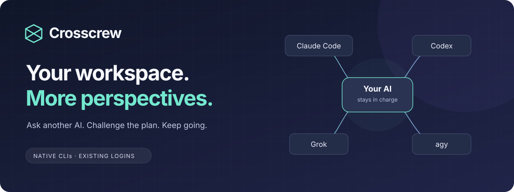
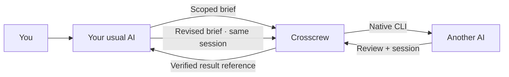

<div align="center">



**An independent perspective, without leaving the AI you already use.**

[](https://github.com/ktaey7/crosscrew/actions/workflows/tests.yml)
[](LICENSE)
[](docs/usage.md#install-from-source)
[](https://github.com/ktaey7/crosscrew/releases)

[Get started](#install-from-source) · [See it in action](#a-review-that-changed-the-plan) · [How it works](#how-it-works) · [한국어](README.ko.md)

</div>

## Keep your workflow. Add another point of view.

You're working with your usual AI. The plan looks reasonable—but before building
it, you want a different model to find what you've missed.

> “Use Crosscrew to ask Claude to challenge this plan.
> After we revise it, send it back to the same reviewer.”

Crosscrew connects your current AI environment to other **native AI CLIs**.
Your main AI keeps the conversation, evaluates the feedback, and carries on.
The reviewer can keep its session for the next round.

| When you want… | Ask Crosscrew to… |
|---|---|
| A second opinion on a design | Have another model challenge the assumptions and failure cases. |
| A check before shipping | Get an independent review of the implementation and evidence. |
| A better plan | Send the revised plan back to the same reviewer and check what remains. |

Bring the CLIs you're already signed into. You don't need every provider,
and you don't need a new dashboard.

## A review that changed the plan

In a hands-on check on **September 7, 2026**, Crosscrew was installed from its
public release into a separate test directory. The host was Codex; the external
reviewer was Claude, using its existing native login.

| Step | What happened |
|---|---|
| **Review** | Claude rejected a sample CSV-import plan: partial writes and retries could create duplicate records. **HOLD.** |
| **Revise** | The host added atomic writes, idempotency, validation and explicit failure tests. |
| **Re-review** | The same Claude session recognized the fixes, identified remaining details, and gave the implementation plan a **PASS**. |

Session IDs matched. The reviewer recalled a check word from its first response
without being given it again. Both result files passed size and SHA-256 checks.
A wait timed out and was resumed using the same job ID, without restarting the worker.

This check also found a real bug: a broker-started job returned a failure exit code
while already running. It was fixed in
[v0.1.0-alpha.3](https://github.com/ktaey7/crosscrew/releases/tag/v0.1.0-alpha.3),
with a regression test. **402 tests** passed locally and on the macOS Python
3.11 / 3.13 [CI matrix](https://github.com/ktaey7/crosscrew/actions/runs/34098984601).
This is evidence for one working review loop—not a claim that every host combination is verified.

## How it works



- **One place for the wiring.** Provider flags, routes and session handling live in the adapter, not in every host prompt.
- **Work you can come back to.** Keep a job ID, wait in the background, and recover the result after reconnecting.
- **Follow-up with context.** Start a fresh review, then resume that reviewer's session with your changes.
- **Results you can check.** Read the result file referenced by path, size and hash. Your host still decides whether the answer holds up.

A small supervisor, native CLI adapters and an optional loopback broker do the work.
[Read the architecture →](architecture.md)

## Install from source

**You'll need:** macOS, Python **3.11+**, and the native CLIs you want to use,
already installed and logged in. Crosscrew uses their normal authentication;
it does not copy credentials or ask you to extract tokens.

```bash
git clone https://github.com/ktaey7/crosscrew.git "$HOME/.local/share/crosscrew"
cd "$HOME/.local/share/crosscrew"
python3 install.py --dry-run --host claude --host codex
python3 install.py --host claude --host codex
```

Choose the hosts you actually use. Add `~/.local/bin` to your shell's PATH if needed,
then start a new host session if the entrypoint isn't visible.

```bash
crosscrew doctor --providers claude codex
```

The installer adds named Crosscrew entrypoints and refuses unrelated file conflicts.
It does not replace your global AI instructions or start a service.

**Using Codex to call Claude?** That route needs a broker outside the host sandbox.
In an ordinary terminal, run:

```bash
crosscrew broker serve
```

Leave that terminal running, then ask your host AI to use Crosscrew. A persistent
macOS service is optional. [Full setup, routes and service instructions →](docs/usage.md)

<details>
<summary><strong>Prefer the command line? See the review / re-review flow.</strong></summary>

```bash
crosscrew job start claude /absolute/path/review.md \
  --host codex --target /absolute/path/project \
  --profile review --mode fresh --run-id design-review
crosscrew job wait JOB_ID_FROM_START

# After reviewing the feedback and revising the plan:
crosscrew job start claude /absolute/path/follow-up.md \
  --host codex --target /absolute/path/project \
  --profile review --mode resume --run-id design-review
crosscrew job wait SECOND_JOB_ID
```

Use the actual host and save the returned job IDs. A brief supplies the necessary
context; the whole host conversation isn't copied automatically. A wait timeout
doesn't cancel the worker. [Compact calling card →](quick-contract.md)

</details>

## Where it works today

| Surface / provider | Current scope |
|---|---|
| **Claude Code + Codex** | Initial focus. Codex → Claude review and same-session follow-up verified with real calls. |
| **Grok** | Adapter and host entrypoint included; experimental. |
| **Antigravity (`agy`)** | Experimental adapter; no stable fresh-session flow or automatic host installation. |
| **Browser-only chats** | Cannot run this local CLI directly. |

**Alpha boundaries:** background notifications depend on the host. Claude's review
profile is a prompt guard, not an OS write barrier. Existing native settings and
hooks can apply. The broker runs with your account's privileges outside the host sandbox.

Existing CLI login also does not guarantee subscription-only billing: native
settings and extra usage still matter. Crosscrew blocks known API-auth overrides
but cannot fully verify billing. [Authentication details](docs/usage.md#authentication-and-billing)
· [Security](SECURITY.md)

## Crosscrew + Council

**Crosscrew gets another AI into the conversation.
[Council](https://github.com/ktaey7/multi-agent-council) defines how a structured debate is conducted.**

Use Crosscrew on its own for a second opinion. Use Council's methodology when you
want independent positions, anonymized criticism and explicit treatment of dissent.
They are separate projects; Council's existing public runner is not a bundled
Crosscrew integration.

## Update and remove

Finish running jobs before updating. The source checkout, selected entrypoints and
optional broker each have an explicit update/removal path. Runtime state is kept
outside the checkout and retained on uninstall.

[Update, rollback considerations and removal →](docs/usage.md#update-and-remove)

## Help shape the next version

Try **one real review and one follow-up**. Tell us where installation got in the
way, what your host failed to notice, or whether the second perspective changed
your decision. That feedback is more useful than adding another layer of orchestration.

[Report an issue](https://github.com/ktaey7/crosscrew/issues) · [Contribute](CONTRIBUTING.md)
· [Releases](https://github.com/ktaey7/crosscrew/releases)

Crosscrew grew out of a personal multi-AI workflow. Multi-model delegation isn't
unique to this project; we're testing whether a compact shared adapter makes it
easier to use across the environments people already prefer.

MIT licensed. Built in part on [netwaif/multi-agent-starter](https://github.com/netwaif/multi-agent-starter).
[Attribution](NOTICE). Not affiliated with the AI providers.
